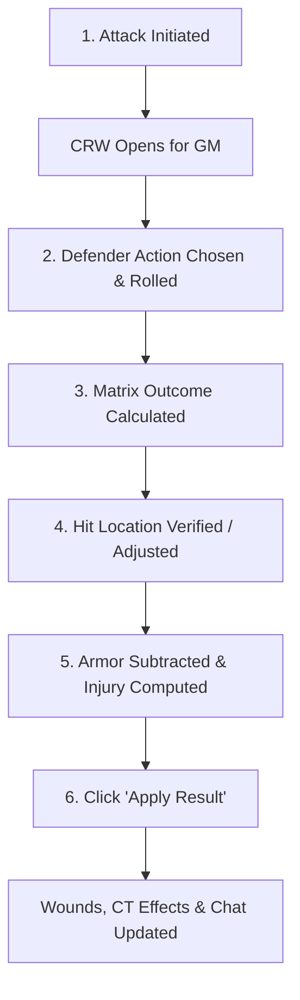

# Combat Resolution Utility

The **Combat Resolution Window (CRW)** is the central interactive hub in Fantasy Grounds Unity for resolving HarnMaster combat. Whenever an attack is made, this window opens automatically for the Game Master, coordinating the attacker's roll, the defender's tactical response, hit location determinations, armor deductions, and injury generation.

---

## Overview & Workflow



1. **Attack Initiated**: A player or GM rolls an attack from the character sheet or Combat Tracker.
2. **Window Opens**: The Combat Resolution Window opens, populated with the attacker's weapon, roll result, aim zone, and base damage aspect.
3. **Defender Rolls**: The defender chooses their defense action (Block, Dodge, Counterstrike, or Ignore) and rolls. The CRW updates immediately.
4. **Outcome Displayed**: The Combat Matrix result is calculated and displayed (e.g. `A*2`, `D*1`, `Block`).
5. **Hit Location & Armor**: The struck body part is highlighted in the location grid. Effective Impact is computed against the defender's worn armor at that location.
6. **Confirmation**: The GM reviews or overrides any field and clicks **Apply Result** to apply injuries and effects to the Combat Tracker and character sheet.

---

## Window Interface Breakdown

The Combat Resolution Window is divided into intuitive, collapsible panels:

```
┌────────────────────────────────────────────────────────┐
│  Combat Resolution                                     │
├────────────────────────────────────────────────────────┤
│  Attacker: Broadsword (ML 65)                          │
│  Attacker Test: [ Marginal Success (MS)  ▼ ]           │
│  Defender Action: [ Block                ▼ ]           │
│  Defender Test: [ Marginal Failure (MF)  ▼ ]           │
│  Matrix Result: A*2 (Attacker Hits x2)                 │
│  [ Announce Roll to Chat ]                             │
├────────────────────────────────────────────────────────┤
│  Damage Aspect: [ Edge ▼ ]   Side: [ Left ▼ ]          │
│  Base Impact: [ 12 ]       Effective Impact: [ 7 ]     │
│  Injury Level: Serious Wound (S3)                      │
├────────────────────────────────────────────────────────┤
│  STRIKE LOCATIONS                                      │
│  [ Skull ]  [ Forearm ]  [ > L. Shoulder < ]  [ Thigh ] │
├────────────────────────────────────────────────────────┤
│  [ Apply Result ]                   [ Cancel ]         │
└────────────────────────────────────────────────────────┘
```

---

## 1. Roll Results Panel

This section tracks the opposed check and matrix lookup:

* **Attacker Weapon & Test**: Shows the weapon name and attacker success level (**CS** - Critical Success, **MS** - Marginal Success, **MF** - Marginal Failure, **CF** - Critical Failure). The GM can cycle through these if a manual adjustment or GM fiat is desired.
* **Defender Action**: A cycler allowing selection of the defender's reaction:
    * **Block**: Uses weapon/shield defense Mastery Level.
    * **Counterstrike**: Defender attacks simultaneously; both rolls are compared on the matrix.
    * **Dodge**: Agility-based evasion test.
    * **Ignore**: Defender takes no defensive action (auto Critical Failure for defense).
* **Defender Test**: The defender's rolled success level (**CS**, **MS**, **MF**, **CF**).
* **Matrix Result**: Automatically looks up the interaction in official HarnMaster tables:
    * `A*1`, `A*2`, `A*3`, `A*4`: Attacker hits with indicated impact multiplier.
    * `D*1`, `D*2`: Defender counterstrike hits attacker.
    * `Block` / `Dodge`: Attack is completely neutralized.
    * `--`: Tactical standoff; neither side deals damage.
* **Announce Roll**: Clicking this button broadcasts the current attack/defense narrative and matrix result to the chat log for all players to see.

---

## 2. Damage & Injury Calculation Panel

When the matrix indicates a successful hit, this panel calculates injury severity:

* **Damage Aspect**: Displays the active weapon aspect (**Blunt**, **Edge**, **Point**, or **Fire**). Can be cycled to adjust for special weapon usage or damage types.
* **Side (Left / Right)**: Indicates whether the left or right side of the body was struck.
* **Base Impact & Effective Impact**:
    * **Base Impact**: Weapon impact multiplied by the matrix multiplier ($A \times N$).
    * **Effective Impact (EI)**: Automatically deducts the defender's armor value covering the specific hit location.
* **Injury Level**: Displays the computed wound severity (**Minor**, **Serious**, **Grievous**, or **Amputation**) based on the body part and remaining Effective Impact.

---

## 3. Hit Location Grid & Face Sub-Table

The utility includes an interactive body location picker:

* **Automated Roll Selection**: The location determined by the attack roll is automatically highlighted in red.
* **Manual Override**: The GM can click any location button (e.g., *Skull*, *Thorax*, *Forearm*, *Thigh*) to change the targeted location on the fly; the effective impact and armor values recalculate immediately.
* **Face Sub-Location Grid**: If the struck location is **Face**, a secondary grid appears allowing granular targeting for:
    * *Eye*, *Cheek*, *Nose*, *Mouth*, *Jaw*, or *Ear*.

---

## 4. NPC Defender Actions Panel

When attacking an NPC, the window displays the NPC's available actions, traits, and combat powers directly below the damage panel. This allows the GM to quickly review special defenses, resistances, or reactions without needing to open the NPC stat sheet.

---

## 5. Applying the Result

At the bottom of the window:

* **Apply Result**:
    * Applies the calculated wound directly to the defender's **Injuries Tab**.
    * Updates current total injury penalties on the character sheet and Combat Tracker.
    * Generates required **Shock Rolls**, **Stumble/Knockdown** prompts, or **Bleeding** rates in the chat window.
    * Closes the Combat Resolution Window.
* **Cancel**: Closes the resolution window without applying any damage or status changes.

---

## Counterstrike Handling

When a defender chooses **Counterstrike**:
1. The defender makes an attack roll against the original attacker.
2. The resolution matrix compares both rolls.
3. If the defender succeeds, a linked secondary resolution window opens with the roles reversed, allowing immediate resolution of the counterstrike impact and injury.
