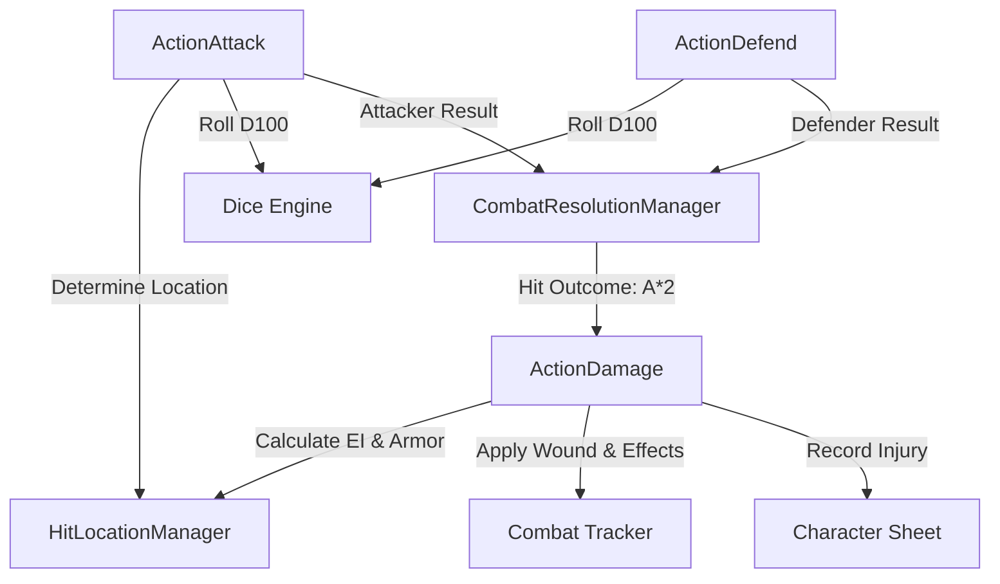

# Combat System

The HarnMaster 3.5E ruleset implements a highly detailed, tactical combat flow designed for realism and fast table resolution. This page outlines the technical implementation and execution sequence.

---

## 1. Attack Sequence

1. **Initiation**: The attacker rolls an attack (via double-click or drag-and-drop to target) from their weapon entry on the character sheet or combat tracker.
2. **Handler**: `ActionAttack.onAttack` (`manager_action_attack_hm3.lua`) processes the roll.
3. **Hit Location Determination**:
    * The system calls `HitLocationManager.getHitLocation` (`manager_hitlocations_hm3.lua`).
    * **Inputs**: Target Actor, Attack Zone (High / Mid / Low), Aiming Zone (optional).
    * **Logic**: Rolls against the appropriate Hit Location table (Humanoid, Quadruped, etc.) to determine the specific body part (e.g., *Skull*, *L. Shoulder*, *Groin*).
    * **Result**: Stored in the action message and queued for resolution.

---

## 2. Defense Sequence

1. **Reaction**: The defender chooses their tactical response (Block, Dodge, Counterstrike, or Ignore).
2. **Handler**: `ActionDefend.onDefend` (`manager_action_defend_hm3.lua`).
3. **Data Capture**: The defender's roll result and Success Level (Critical Success, Marginal Success, Marginal Failure, Critical Failure) are captured and paired with the attack.

---

## 3. Combat Resolution (The Matrix)

HarnMaster compares the Attacker's Success Level against the Defender's Success Level to determine the outcome.

* **Manager**: `CombatResolutionManager` (`manager_combat_resolution_hm3.lua`).
* **Key Function**: `getMatrixResult(sAttackResult, sDefenseResult)`
* **Process**:
    1. Looks up the outcome in the standard HarnMaster Combat Matrix (`data_common_hm3.lua`).
    2. **Result Codes**:
        * `A*N`: Attacker hits with Damage Multiplier $N$ (e.g., `A*1`, `A*2`, `A*3`).
        * `D*N`: Defender achieves Counterstrike with Damage Multiplier $N$.
        * `Block` / `Dodge`: Attack is completely neutralized.
        * `--`: Tactical standoff / no damage.

---

## 4. Damage & Injury Application

When a hit occurs:

1. **Effective Impact (EI) Calculation**:
    $$\text{Effective Impact} = (\text{Weapon Base Impact} \times \text{Multiplier}) - \text{Location Armor Protection}$$
2. **Handler**: `ActionDamage` (`manager_action_damage_hm3.lua`).
3. **Injury Determination**:
    * The remaining Effective Impact is mapped against the struck body location's injury thresholds.
    * Generates an **Injury** record classified by severity (**Minor**, **Serious**, or **Grievous**) and injury type (Cut, Stab, Crush, Burn, etc.).
4. **Effect Application**:
    * Automated Shock Rolls, Stun, Bleeding rates, and Amputation effects are applied directly to the Combat Tracker and Character Injury list.

---

## Architecture Flowchart

